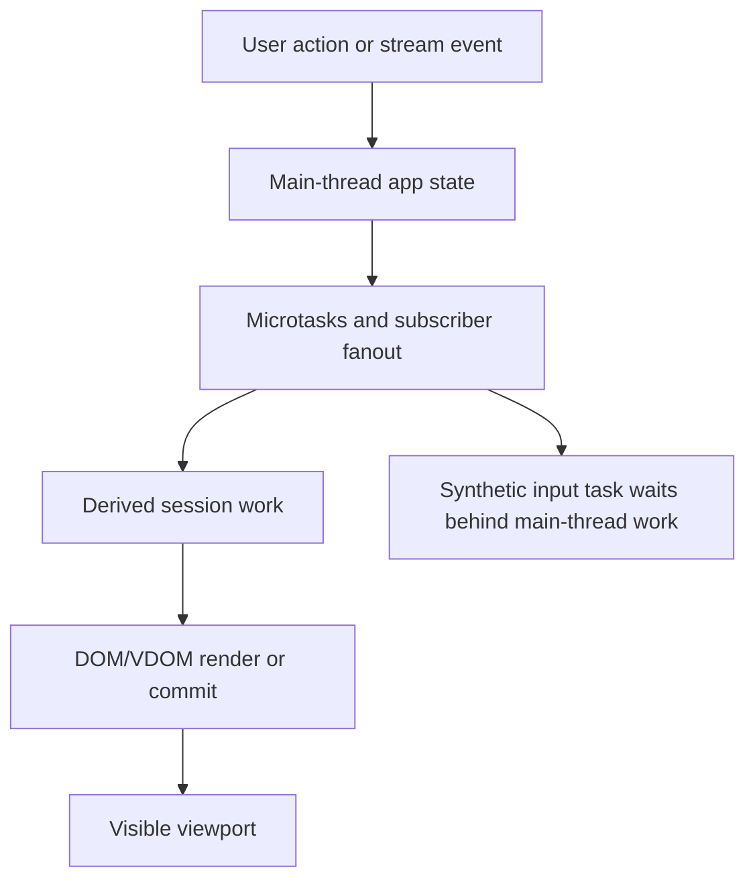
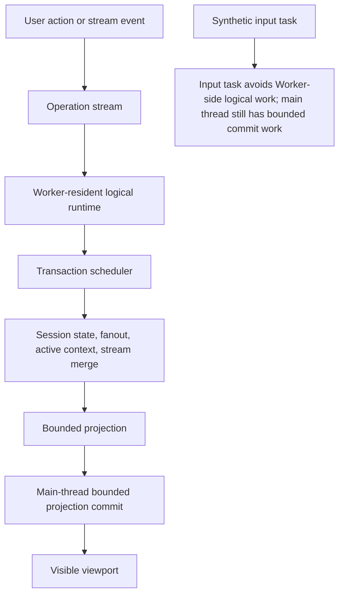
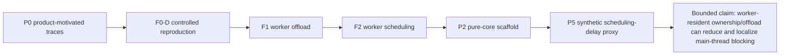

# Architecture Diagrams

These diagrams explain the runtime direction at a portfolio level. They are conceptual diagrams, not production implementation diagrams.

## Diagram A: Document/DOM Ownership Path

The risk in this path is not only DOM size. The risk is that session-scale logical work and visible commit work can share the same main-thread ownership path.

## Diagram B: Worker-Resident Runtime Direction

This direction does not remove main-thread work. It localizes the main-thread role toward bounded projection commit while moving session-scale logical work into Worker ownership.

## Diagram C: Evidence Chain

Boundary: this evidence chain supports a research-backed runtime direction. It does not prove browser-level INP, Event Timing, production readiness, real product superiority, P4/WebGPU authorization, or P7 productization.
